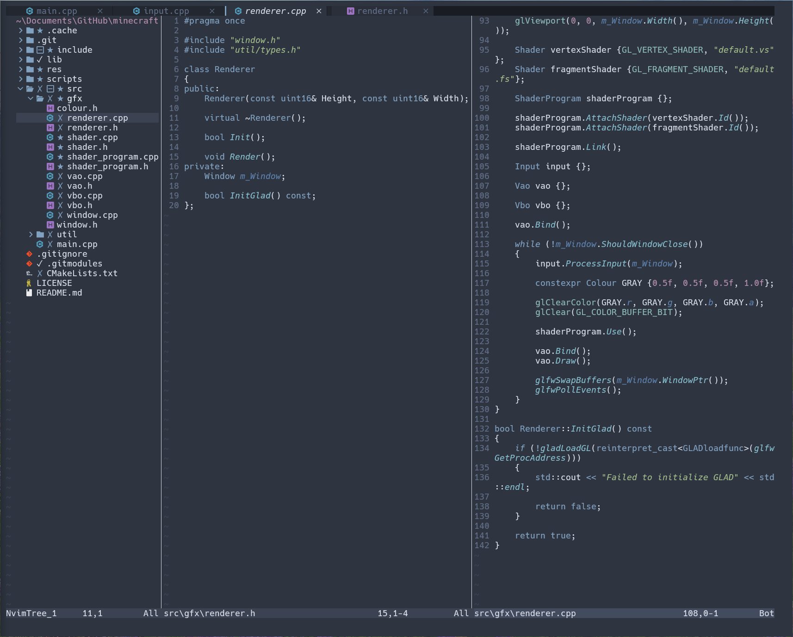

# Description
This is my custom config for neovim.


# Requirements
- In order to use [minimap.vim](https://github.com/wfxr/minimap.vim) you need to install [code minimap](https://github.com/wfxr/code-minimap) and add the executable to your path
# Setup
- In neovim run `PlugInstall` to install the plugins
- Make sure to change the `plugin_directory` variable in `init.lua` to point to where your `init.lua` is
- The location for my `init.lua` is in `C:/Users/${User}/Appdata/Local/nvim/`
# Adding a Plugin
- Create a file in the `plugins` directory (for example `nvim-tree.lua`)
- Add the following:
```lua
return {
  url = "User/Repo",
  dependencies = {
    "DependencyOne",
    "DependencyTwo",
    "etc"
  },
  config = function()
    -- Code
  end
}
```
- In `init.lua` add the file name to `module_install_order` and `module_config_order`
# Plugins
- [bufferline.nvim](https://github.com/akinsho/bufferline.nvim)
- [cmp-nvim-lsp](https://github.com/hrsh7th/cmp-nvim-lsp)
- [cmp-vsnip](https://github.com/hrsh7th/cmp-vsnip)
- [diffview.nvim](https://github.com/sindrets/diffview.nvim)
- [markview.nvim](https://github.com/OXY2DEV/markview.nvim)
- [mason.nvim](https://github.com/williamboman/mason.nvim)
- [mason-lspconfig.nvim](https://github.com/williamboman/mason-lspconfig.nvim)
- [mason-nvim-dap.nvim](https://github.com/jay-babu/mason-nvim-dap.nvim)
- [minimap.vim](https://github.com/wfxr/minimap.vim)
- [nord.nvim](https://github.com/shaunsingh/nord.nvim)
- [nvim-cmp](https://github.com/hrsh7th/nvim-cmp)
- [nvim-dap](https://github.com/mfussenegger/nvim-dap)
- [nvim-dap-ui](https://github.com/rcarriga/nvim-dap-ui)
- [nvim-lspconfig](https://github.com/neovim/nvim-lspconfig)
- [nvim-nio](https://github.com/nvim-neotest/nvim-nio)
- [nvim-tree](https://github.com/nvim-tree/nvim-tree.lua)
- [nvim-web-devicons](https://github.com/nvim-tree/nvim-web-devicons)
- [plenary.nvim](https://github.com/nvim-lua/plenary.nvim)
- [telescope.nvim](https://github.com/nvim-telescope/telescope.nvim)
- [toggleterm.nvim](https://github.com/akinsho/toggleterm.nvim)
- [vim-vsnip](https://github.com/hrsh7th/vim-vsnip)
# Troubleshooting
## Executing PowerShell Scripts Opens Notepad
- Open a PowerShell script and set the default program to open it to PowerShell
    - This is located in `%SystemRoot%\system32\WindowsPowerShell\v1.0\powershell.exe`
